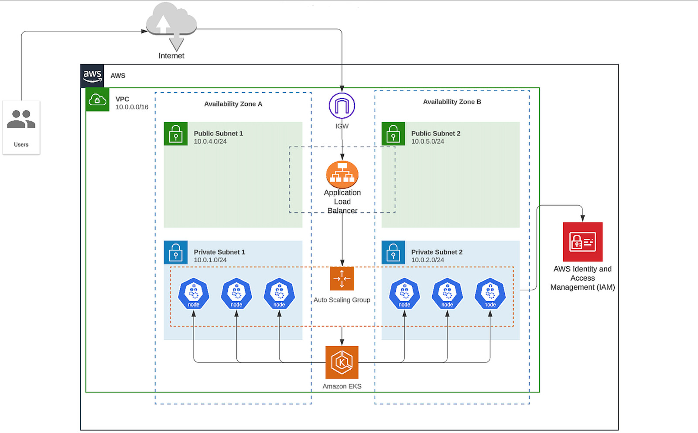

# EKS Project (Terraform + Kubernetes)

This repository provisions an AWS EKS cluster with networking, IAM, an Application Load Balancer (ALB), and a sample Nginx application demonstrating pod access to S3 using IRSA (IAM Roles for Service Accounts).

**Region:** eu-central-1

**Quick Links:**
- Terraform: [eks.tf](eks.tf)
- Networking: [vpc.tf](vpc.tf)
- IAM: [iam.tf](iam.tf)
- ALB: [alb.tf](alb.tf)
- S3: [s3.tf](s3.tf)
- Kubernetes manifests: [k8s-manifests.yaml](k8s-manifests.yaml)

**Overview**
- VPC with public and private subnets (2 AZs).
- Internet Gateway and NAT Gateway for private subnet egress.
- EKS control plane (`production-eks-cluster`) with a managed node group (`t3.medium`, desired 2).
- ALB in public subnets forwards to the EKS nodes on a NodePort (30080).
- An S3 bucket (`devsecops-demo-bucket-unique-suffix`) exists for pod access demos.
- IAM roles: EKS cluster role, node role, and a pod identity role (`eks-pod-s3-read-role`) bound to the `nginx-s3-sa` ServiceAccount.

**Architecture Diagram**

The diagram below shows the VPC, public/private subnets, ALB, EKS worker nodes, and IAM integration.



**Components (from repo)**
- `providers.tf`: sets provider to `eu-central-1`.
- `vpc.tf`: VPC, public/private subnets, IGW, NAT Gateway, route tables.
- `iam.tf`: IAM roles and policies (`eks-cluster-role`, `eks-node-group-role`, `eks-pod-s3-read-role`) — the pod role uses a web-identity (IRSA) trust to the cluster OIDC provider.
- `eks.tf`: EKS cluster `production-eks-cluster`, managed node group, and an IAM OIDC provider resource for IRSA.
- `alb.tf`: Application Load Balancer in public subnets forwarding to NodePort `30080` on instances.
- `s3.tf`: S3 bucket `devsecops-demo-bucket-unique-suffix`.
- `k8s-manifests.yaml`: `nginx` Deployment (replicas: 2) + `NodePort` Service (nodePort: 30080) using `nginx-s3-sa`.

**Deploy (quick)**
1. Initialize Terraform and review plan:

```bash
terraform init
terraform plan
```

2. Apply infrastructure (this will create the EKS cluster, node group, the IAM OIDC provider, and the pod role):

```bash
terraform apply -auto-approve
```

3. Configure `kubectl` (use outputs):

```bash
# get kubeconfig via terraform or aws-cli; example using aws eks:
aws eks update-kubeconfig --name $(terraform output -raw cluster_name) --region eu-central-1

# then apply the manifests
kubectl apply -f k8s-manifests.yaml
```

4. Access the app via the ALB DNS (see AWS console or fetch `aws_lb.main.dns_name`).

**Notes & TODOs**
- Update `aws_eks_access_entry` principal ARN in `eks.tf` to match your admin user.
- Ensure the S3 bucket name is globally unique if changing it.
- The Terraform assumes two availability zones are available in the account/region.
- The repo now implements IRSA: `aws_iam_openid_connect_provider` in `eks.tf` and the pod role in `iam.tf` use a web-identity trust to the cluster OIDC provider.


